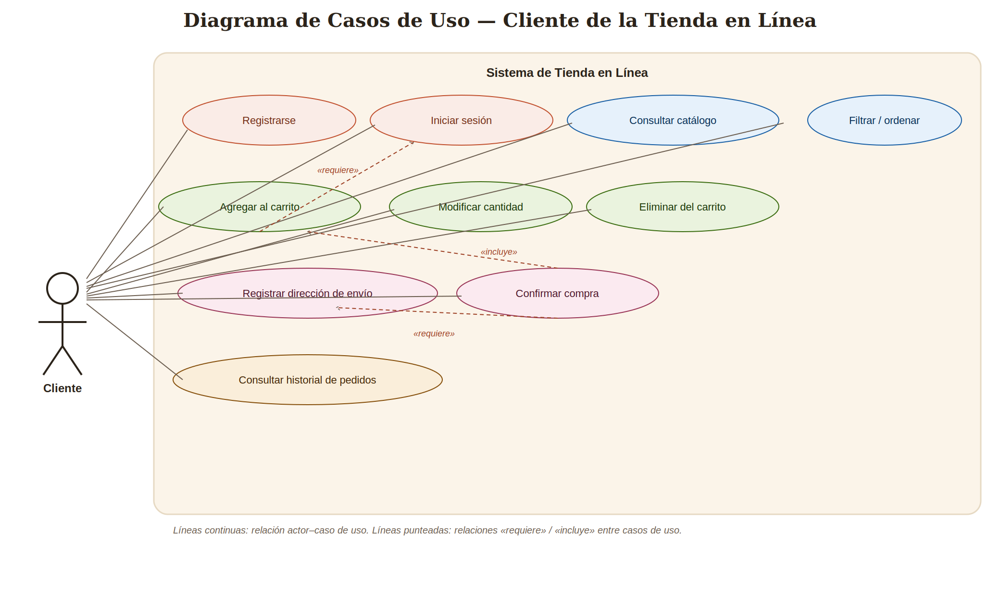
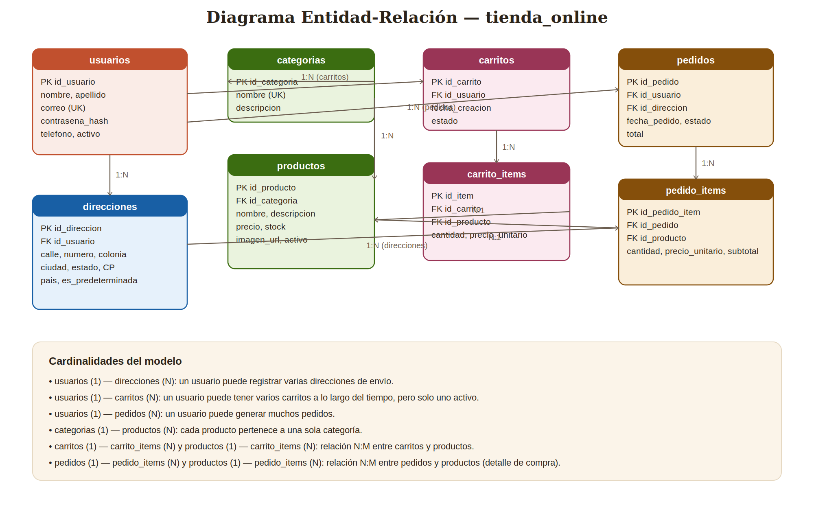
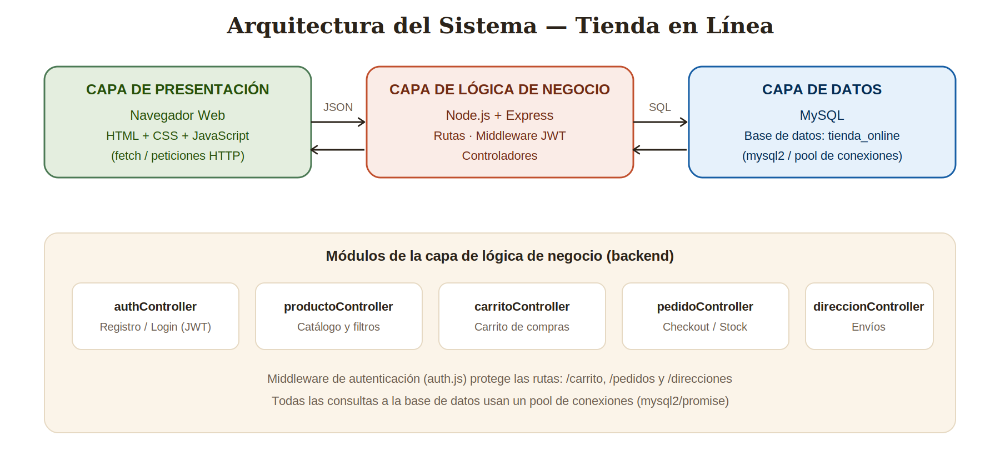

# Tianguis Digital — Tienda en Línea

Proyecto de la materia **Desarrollo e Implementación de Sistemas**. Sistema de tienda en línea (e-commerce) con registro/inicio de sesión, catálogo de productos, carrito de compras, checkout y control de inventario, construido con **Node.js + Express** en el backend y **MySQL** como base de datos.

> La documentación completa y extendida (con diagramas, requisitos y modelado de datos) está en [`docs/Proyecto_Desarrollo_e_Implementacion_de_Sistemas.docx`](./docs/Proyecto_Desarrollo_e_Implementacion_de_Sistemas.docx). Este README resume lo esencial para instalar y ejecutar el proyecto.

## Tabla de contenido

- [Introducción](#introducción)
- [Resumen del sistema](#resumen-del-sistema)
- [Requisitos](#requisitos)
- [Casos de uso](#casos-de-uso)
- [Entidades y diagrama entidad-relación](#entidades-y-diagrama-entidad-relación)
- [Arquitectura del sistema](#arquitectura-del-sistema)
- [Diseño de interfaz](#diseño-de-interfaz)
- [Estructura del proyecto](#estructura-del-proyecto)
- [Instalación y configuración](#instalación-y-configuración)
- [Uso y operación del sistema](#uso-y-operación-del-sistema)
- [Base de datos](#base-de-datos)
- [Conclusión](#conclusión)

## Introducción

Tianguis Digital permite a un cliente registrarse, iniciar sesión, explorar un catálogo de productos, agregar artículos a un carrito, registrar una dirección de envío y confirmar su compra. El inventario se actualiza automáticamente con cada venta.

## Resumen del sistema

- Registro e inicio de sesión con contraseñas cifradas (bcrypt) y JWT.
- Catálogo de productos con filtro por categoría y orden por precio/nombre.
- Carrito de compras persistente por usuario (agregar, modificar, eliminar).
- Registro de direcciones de envío.
- Checkout que genera un pedido y descuenta stock dentro de una transacción SQL.
- Historial de pedidos por usuario.

## Requisitos

### Funcionales
1. Registro de clientes.
2. Inicio de sesión.
3. Catálogo público de productos.
4. Filtros y orden del catálogo.
5. Carrito de compras (agregar / modificar / eliminar).
6. Registro de direcciones de envío.
7. Confirmación de compra (checkout).
8. Actualización automática de inventario.
9. Historial de pedidos.

### No funcionales
- Seguridad: contraseñas con hash bcrypt, rutas protegidas con JWT.
- Consistencia: transacciones SQL en el checkout.
- Escalabilidad: pool de conexiones a MySQL.
- Mantenibilidad: separación en rutas / controladores / middleware.

### Técnicos

| Componente | Tecnología | Versión recomendada |
|---|---|---|
| Entorno de ejecución | Node.js | 18.x o superior |
| Framework backend | Express.js | 4.19.x |
| Base de datos | MySQL / MariaDB | 8.0 / 10.11+ |
| Cliente de BD | mysql2 (promise) | 3.10.x |
| Autenticación | jsonwebtoken + bcryptjs | 9.x / 2.4.x |
| Frontend | HTML5, CSS3, JS (vanilla) | — |

## Casos de uso



| Caso de uso | Actor | Descripción |
|---|---|---|
| Registrarse | Cliente | Crea una cuenta con sus datos personales. |
| Iniciar sesión | Cliente | Se autentica con correo y contraseña. |
| Consultar catálogo | Cliente/Visitante | Ve el listado de productos. |
| Filtrar/ordenar productos | Cliente/Visitante | Acota o reordena el catálogo. |
| Agregar al carrito | Cliente | Añade un producto y cantidad al carrito activo. |
| Modificar cantidad | Cliente | Cambia la cantidad de un producto en el carrito. |
| Eliminar del carrito | Cliente | Retira un producto del carrito. |
| Registrar dirección de envío | Cliente | Da de alta una dirección de entrega. |
| Confirmar compra | Cliente | Genera el pedido y descuenta inventario. |
| Consultar historial de pedidos | Cliente | Revisa compras anteriores. |

## Entidades y diagrama entidad-relación



8 entidades: `usuarios`, `direcciones`, `categorias`, `productos`, `carritos`, `carrito_items`, `pedidos`, `pedido_items`. El script completo está en [`backend/src/db/schema.sql`](./backend/src/db/schema.sql).

## Arquitectura del sistema



Arquitectura de tres capas:
- **Presentación**: HTML/CSS/JS (carpeta `frontend/public`), consume la API vía `fetch`.
- **Lógica de negocio**: Node.js + Express (carpeta `backend/src`), rutas → middleware JWT → controladores.
- **Datos**: MySQL, acceso mediante `mysql2` con pool de conexiones y transacciones en el checkout.

## Diseño de interfaz

Prototipo funcional construido directamente en HTML/CSS/JS (carpeta `frontend/public/`), con identidad visual propia ("Tianguis Digital"): paleta cálida (arena, terracota, verde aguacate), tipografías Fraunces + Inter + JetBrains Mono, totalmente responsivo.

## Estructura del proyecto

```
tienda-online/
├── backend/
│   ├── src/
│   │   ├── config/db.js
│   │   ├── controllers/        (auth, producto, carrito, pedido, direccion)
│   │   ├── middleware/auth.js
│   │   ├── routes/              (auth, producto, carrito, pedido, direccion)
│   │   ├── db/schema.sql
│   │   └── app.js
│   ├── .env.example
│   └── package.json
├── frontend/
│   └── public/ (index.html, css/, js/)
├── docs/
│   ├── diagramas/
│   └── Proyecto_Desarrollo_e_Implementacion_de_Sistemas.docx
├── .gitignore
└── README.md
```

## Instalación y configuración

### Requisitos previos
- Node.js 18+ y npm
- MySQL u MariaDB 8.0 / 10.11+ **o** Docker (ver opción A abajo)
- Visual Studio Code y Git

### Opción A — Base de datos con Docker (recomendado si no tienes MySQL instalado)

El proyecto incluye un `docker-compose.yml` que levanta MySQL ya configurado y carga el esquema automáticamente la primera vez.

```bash
# Desde la raíz del proyecto (donde está docker-compose.yml)
docker compose up -d
```

Eso es todo — Docker descarga MySQL 8.0, crea la base `tienda_online`, y ejecuta `backend/src/db/schema.sql` automáticamente (tablas + productos de ejemplo). El `.env.example` ya trae las credenciales que coinciden con este contenedor (`usuario: root`, `password: rootpass123`), así que solo necesitas copiarlo:

```bash
cd backend
cp .env.example .env
```

Para verificar que el contenedor está corriendo: `docker ps` (debe aparecer `tienda_online_mysql`).
Para detenerlo: `docker compose down` (tus datos persisten). Para borrar todo y empezar de cero: `docker compose down -v`.

### Opción B — MySQL instalado localmente

### Pasos (instalación de dependencias y arranque)

```bash
# 1. Clonar el repositorio
git clone <URL-del-repositorio>
cd tienda-online

# 2. Instalar dependencias del backend
cd backend
npm install

# 3. Crear la base de datos
#    - Si usaste la Opción A (Docker), ya está creada, omite este paso.
#    - Si usas MySQL local (Opción B):
mysql -u root -p < src/db/schema.sql

# 4. Configurar variables de entorno
cp .env.example .env
# si usas Docker, los valores por defecto ya funcionan
# si usas MySQL local, edita .env con tu usuario, contraseña y JWT_SECRET

# 5. Iniciar el servidor
npm start
# o, para recarga automática durante desarrollo:
npm run dev
```

Abre `http://localhost:3000` en el navegador — el backend también sirve el prototipo de interfaz.

### Variables de entorno (`backend/.env`)

```
PORT=3000

DB_HOST=localhost
DB_PORT=3306
DB_USER=root
DB_PASSWORD=tu_password
DB_NAME=tienda_online

JWT_SECRET=cambia_este_valor_por_un_secreto_seguro
JWT_EXPIRES_IN=2h
```

## Uso y operación del sistema

1. El cliente consulta el catálogo (sin necesidad de sesión).
2. Filtra/ordena productos según prefiera.
3. Al agregar un producto al carrito sin sesión, se le pide iniciar sesión o registrarse.
4. Inicia sesión o se registra.
5. Agrega productos al carrito; puede modificar cantidades o eliminarlos.
6. Abre el carrito y procede al checkout.
7. Indica una dirección de envío y confirma el pedido.
8. El sistema descuenta el stock y marca el carrito como finalizado.
9. Puede consultar su historial de pedidos en cualquier momento.

### Principales endpoints de la API

| Método | Endpoint | Descripción | Token |
|---|---|---|---|
| POST | `/api/auth/registro` | Registra un usuario. | No |
| POST | `/api/auth/login` | Inicia sesión, devuelve JWT. | No |
| GET | `/api/productos` | Lista el catálogo (`?categoria`, `?orden`). | No |
| GET | `/api/productos/categorias` | Lista categorías. | No |
| GET | `/api/carrito` | Carrito activo del usuario. | Sí |
| POST | `/api/carrito` | Agrega un producto al carrito. | Sí |
| PUT | `/api/carrito/:id_item` | Actualiza cantidad. | Sí |
| DELETE | `/api/carrito/:id_item` | Elimina del carrito. | Sí |
| POST | `/api/direcciones` | Registra una dirección. | Sí |
| POST | `/api/pedidos` | Confirma la compra (checkout). | Sí |
| GET | `/api/pedidos` | Historial de pedidos. | Sí |

## Base de datos

Motor MySQL/MariaDB, InnoDB, codificación `utf8mb4`. El script [`backend/src/db/schema.sql`](./backend/src/db/schema.sql) crea las 8 tablas con llaves primarias/foráneas, restricciones `CHECK`/`UNIQUE`, índices, y datos de prueba (categorías y productos).

Decisiones clave: el carrito y el pedido son entidades separadas (el carrito es mutable, el pedido es histórico e inmutable); el stock solo se descuenta al confirmar la compra, dentro de una transacción que valida disponibilidad antes de aplicar cambios; las contraseñas solo se guardan como hash.

## Conclusión

Este proyecto integra el análisis de requisitos, el modelado de datos, una arquitectura en capas, una API REST segura y una interfaz de usuario funcional. Como trabajo futuro: panel de administración, pasarela de pago real, notificaciones por correo y pruebas automatizadas.

---

Documentación extendida con todos los diagramas y el detalle completo: [`docs/Proyecto_Desarrollo_e_Implementacion_de_Sistemas.docx`](./docs/Proyecto_Desarrollo_e_Implementacion_de_Sistemas.docx)
